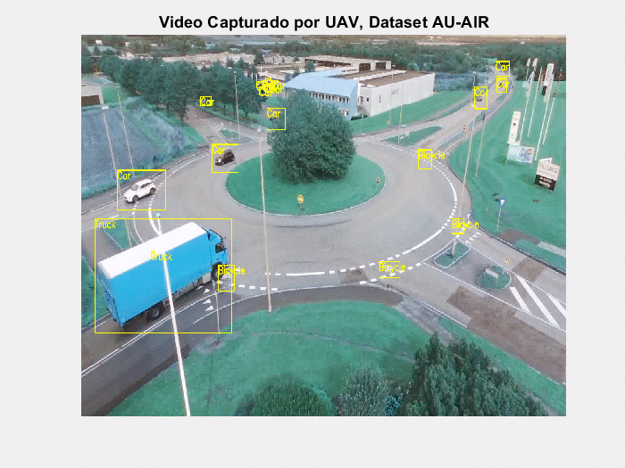
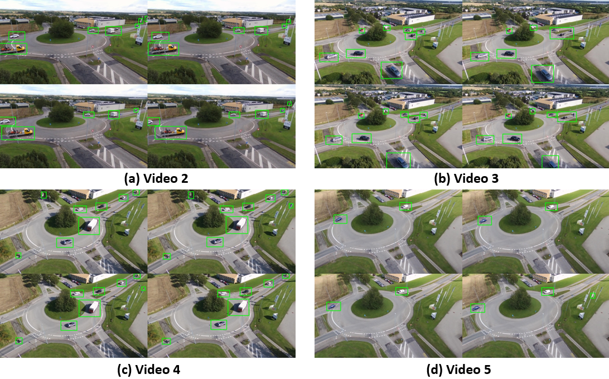
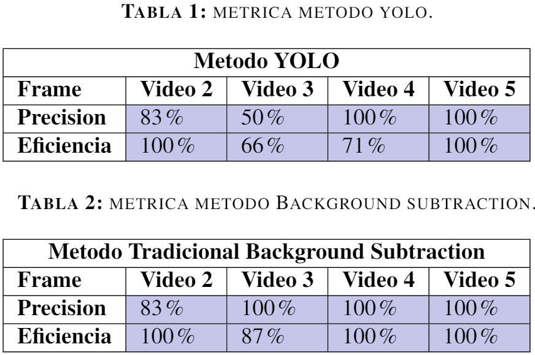

# Object Movement Detection of UAV Video

## Comenzando 🚀

_Estas instrucciones te permitirán obtener una copia del proyecto en funcionamiento en tu máquina local para propósitos de desarrollo y pruebas._
_Asimismo, te permitira corroborar los datos mostrados en el informe final sobre la metodologia y los resultados. 

Mira **Pre-requisitos e instalacion** para conocer como desplegar el proyecto.

### Pre-requisitos 📋

_Dado que los dos metodos, tanto tradicional, como la red se desarrollaron e implementaron en pyhton, se recomiendan las siguientes herramientas:_

```
Pycharm.
Google Colab.
```

### Instalación 🔧

_Para la prueba de los dos metodos se debe descagar el archivo.zip de github._

_Asimismo, es necesario descargar estos dos archivos por aparte, los cuales son:

[Auairdataset-Raw](https://github.com/bozcani/auairdataset) - El dataset utilizado para el entrenamiento de Yolo



[Auairdataset-Postprocesamiento](https://drive.google.com/drive/folders/1bsXkyk1JLjywaGp_BLyiqbAkcDoaK53v?usp=sharing) - El dataset utilizado para las pruebas de metodo tradicional.

_Despues de esto, se abre el proyecto en pycharm de cada una de las carpetas individualmente._

_Y por ultimo se corre el archivo

- [Pruebas Yolo](Red_neuronal/examples/Main.py)

- [Metodo tradicional](Metodo_tradicional/main.py)


### Datos obtenidos y metricas. 🔩

_Explica que verifican estas pruebas y por qué, Tablas obtenidas y las dos imagenes que son el collage._


En esta imagen, se observan las diferentes detecciones de movimientos realizadas por la red neuronal Yolo V3 que ya fue pre entrenada en [Auairdataset](https://github.com/bozcani/auairdataset).

========================



Por otro lado, estos fueron los datos obtenidos por medio del metodo tradicional de backgroudn substraction. 


Tal y como se observa, los resultados de los dos metodos son muy similiares, llegando a la conclusion que apartir de un metodo tradicional es posible competir con los resultados de una red entrenada por 3000 epocas con la necesidad de tener un nivel de computo alto.

==========================

Para realizar la métrica, se escogieron 4 vídeos en los cuales se analizaron para cada uno un instante de tiempo para calcular la precisión y eficiencia del método que se estaba utilizando para esta prueba, usamos primero el método de YOLO y  el método tradicional Background subtraction. En la Tabla 1 y Tabla 2 podemos observar los resultados obtenidos para el método de YOLO y para Background subtraction respectivamente.

La primera métrica, la cual nombramos precisión, consiste en identificar el numero de objetos que se encontraban efectivamente en movimiento y cuantos de estos se lograron detectar, teniendo en cuenta que si se detecta un objeto en movimiento que no se encuentra es un error que se tuvo en cuenta para el valor calculado de acertado. 

Por ultimo, se calculó la eficiencia de los metodos, por medio de la observacion de la calidad de posicionamiento de cuadros delimitadores que existen en cada objeto, es decir, a medida que aumenta el numero de cuadros, menor el numero de eficiencia del metodo. 




## Construido con 🛠️

_Menciona las herramientas que utilizaste para crear tu proyecto_

* [Auairdataset](https://github.com/bozcani/auairdataset) - El dataset utilizado.
* [YoloV3](https://github.com/ultralytics/yolov3) - Red neuronal del estado del arte.
* [Background Substraction](https://core.ac.uk/download/pdf/55245719.pdf) - Metodo tradicional para la deteccion de objetos.

## Autores ✒️

* **Ismael Vega** - *Contribuyente* - [Ismael V](https://github.com/villanuevand)
* **Sergio Andres Mejia Osorio** - *Contribuyente y programador* - [Sergio M](https://github.com/sergioaom31)
* **Pablo Andres Gomez Toloza** - *Contribuyente y programador* - [Pablo G](https://github.com/PabloGomez9801)


---
