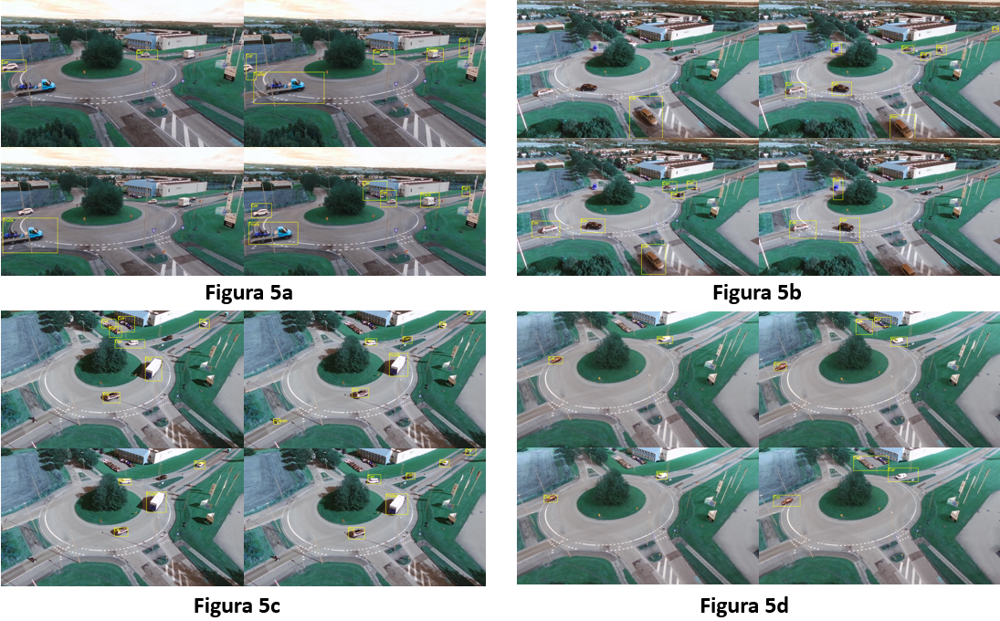

# Object Movement Detection of UAV Video

## Comenzando 🚀

_Estas instrucciones te permitirán obtener una copia del proyecto en funcionamiento en tu máquina local para propósitos de desarrollo y pruebas._
_Asimismo, te permitira corroborar los datos mostrados en el informe final sobre la metodologia y los resultados. 

Mira **Pre-requisitos e instalacion** para conocer como desplegar el proyecto.

### Pre-requisitos 📋

_Dado que los dos metodos, tanto tradicional, como la red se desarrollaron e implementaron en pyhton, se recomiendan las siguientes herramientas:_

```
Pycharm.
Google Colab.
```

### Instalación 🔧

_Para la prueba de los dos metodos se debe descagar el archivo.zip de github._

_Asimismo, es necesario descargar estos dos archivos por aparte, los cuales son:

[Auairdataset-Raw](https://github.com/bozcani/auairdataset) - El dataset utilizado para el entrenamiento de Yolo

[Auairdataset-Postprocesamiento](https://drive.google.com/drive/folders/1bsXkyk1JLjywaGp_BLyiqbAkcDoaK53v?usp=sharing) - El dataset utilizado para las pruebas de metodo tradicional.

_Despues de esto, se abre el proyecto en pycharm de cada una de las carpetas individualmente._

_Y por ultimo se corre el archivo

[Pruebas Yolo](Proyecto_Imagenes/Red_neuronal/examples/Main.py)

[Metodo tradicional](Metodo_Tradicional/main.py)


### Datos obtenidos y metricas. 🔩

_Explica que verifican estas pruebas y por qué, Tablas obtenidas y las dos imagenes que son el collage._



En esta imagen, se observan las diferentes detecciones de movimientos realizadas por la red neuronal Yolo V3 que ya fue pre entrenada en [Auairdataset](https://github.com/bozcani/auairdataset).

========================


Por otro lado, estos fueron los datos obtenidos por medio del metodo tradicional de backgroudn substraction. 


Tal y como se observa, los resultados de los dos metodos son muy similiares, llegando a la conclusion que apartir de un metodo tradicional es posible competir con los resultados de una red entrenada por 3000 epocas con la necesidad de tener un nivel de computo alto.

==========================
Por otro lado, se realizo unas mediciones de la efectividad de cada metodo, con las siguientes metricas:
TABLA
```
Da un ejemplo
```

Obteniendo de esta manera, valores.. TERMINAR

## Construido con 🛠️

_Menciona las herramientas que utilizaste para crear tu proyecto_

* [Auairdataset](https://github.com/bozcani/auairdataset) - El dataset utilizado.
* [YoloV3](https://github.com/ultralytics/yolov3) - Red neuronal del estado del arte.
* [Background Substraction](https://core.ac.uk/download/pdf/55245719.pdf) - Metodo tradicional para la deteccion de objetos.

## Autores ✒️

* **Ismael Vega** - *Contribuyente* - [Ismael V](https://github.com/villanuevand)
* **Sergio Andres Mejia Osorio** - *Contribuyente y programador* - [Sergio M](https://github.com/sergioaom31)
* **Pablo Andres Gomez Toloza** - *Contribuyente y programador* - [Pablo G](https://github.com/PabloGomez9801)


---
